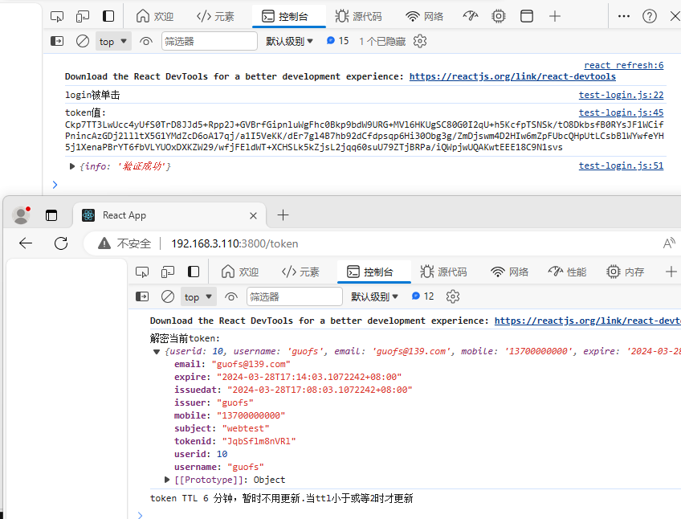

# about JWT and gToken
JWT（JSON Web Token）是一种基于Token的身份验证和授权机制，它使用JSON格式来表示用户身份信息。

jwt在前后端分离项目中常用，jwt是token中一种实现方式之一，如[JWT-dgrijalva](https://pkg.go.dev/github.com/dgrijalva/jwt-go)和[JWT-form3tech](https://pkg.go.dev/github.com/form3tech-oss/jwt-go@v3.2.5+incompatible#section-documentation)第三方包。


gToken是JWT实现方式之一，用来实现前后端基于Token的身份认证。

# gToken使用
gToken是一种非常简单实用的jwt第三方包，token采用AES/CBC模式加密。前后端都可以有效校验token包。
```text
UserID     int         `json:"userid"`     //用户id
UserName   string      `json:"username"`   //用户名称
UserEmail  string      `json:"email"`      //用户邮箱
UserMobile string      `json:"mobile"`     //用户电话
ExpiresAt time.Time    `json:"expire"`     //Token的TTL,即有效期。
IssuedAt time.Time     `json:"issuedat"`   //Token签发时间
Issuer string          `json:"issuer"`     //Token制作者
Subject string         `json:"subject"`    //Token应用的项目
TokenID string         `json:"tokenid"`    //TokenID,主要作用是校验前端提交的token是否真实，防止token泄露而带来的安全风险。
```

`func CreateToken(gtoken *Gtoken,key []byte) (string)`
创建token,其中key是16位或24位或32位的字符切片，返回BASE64字串。

`func CheckToken(encToken string, key []byte) (*Gtoken,int64,error)`
校验token,主要用来检查前端提供的token是否真实有效。
返回参数
- 第一个, token本身的数据信息
- 第二个, 本token的TTL值(分钟),0表示已失效。
- 第三个, err

模块安装
`go get github.com/guofusheng007/gtoken`
模块引用
```text
import (
	"github.com/guofusheng007/gtoken"
)
```

# 示例说明
```text
# tree gtoken
gtoken
├── crypto.go    //加解密模块
├── gtoken.go    //token创建和校验
├── example      //示例
│   ├── go
│   │   ├── go.mod
│   │   ├── go.sum
│   │   └── main.go                //token生成与重签接口
│   └── react
│       ├── crypto.js              //token解密模块
│       ├── index.js               //react入口
│       ├── test-login.js          //login，初始化token
│       └── test-updatetoken.js    //token重签程序
└── README.md
```

目标
- go与react分离交互示例
- 使用go开发jwt模块(加密、校验)
- 使用react前端对jwt进行校验、及刷新token
- 前后端同时具备token校验能力。


前后端jwt认证流程
- 前端用户录入正确的用户名称和密，提交给后端，后端收到后对数据进行验证，通过验证后产生初始token并通过headers返回给用户。
- 前端用户收到后端提交的token后保存在cookie中，供所有页面查看(主要是供token刷新页面使用)
- 其它页面在渲染生效前调用token刷新程序。
  - token刷新程序从cookie查找token，若找不到，直接跳转到login让用户重新登录，重新生成初始化token
  - 若找到token，但token的TTL已失效，则直接跳转到login让用户重新登录，重新生成初始化token。
  - 若token的ttl值生效中，但TTL时间还很长，那不刷新token，让调用它的页面继续。
  - 若token的ttl值小于或等于某个值(示例中为2分钟)，则向后台申请重签token.
- 后端收到前端的token刷新申请时，对前端提供的token及tokenID进校验。此时后端toke刷新程序做如下识别
  - 若收到的token密文件为'undefined'或null,则返回
    `{"info":"Token已过期,不能续签,请重新认证后产生新Token"}`
  - 若收到的token密文正常，则对密文进行校验。
  - 若密文中TTL值小于或等于0,则token已失效，返顺
    `{"info":"Token已过期,不能续签,请重新认证后产生新Token"}`
  - 若用户提效的tokenid与token密文中的tokenid不一致，说明token已泄露或被伪造，拒绝重签token,返回
    `{"info":"用户提交的 TokenID 有误"}`
  - 若token中的TTL值大于某个指定值(如2分钟)，则暂时不用续签，返回如下
    `{"info":"Token TTL大于2分钟,暂时不需要续签"}`
  - 若token中的TTL值小于或等于某个指定值(如2分钟)，则允许重新续签Token。
    将生成的新Token通过headers返回前端，并返回body信息。
    `{"info":"Token更新成功"}`
- 前端token刷新程序收到后端重新签发的token后更新旧token(写入cookie),调用页面继续。

> 提示:
> - 如上验证过程，前端和后端对token的验证是重复的，是有必要，出于安全要求，防止其它用户跳过前端token刷新程序而直接采用curl等来拿到新token.
> - 前端应用认证最长时间，取决于cookie和Token的两个TTL值，最小的TTL是前端最终有效的认证有效期，超过了就需通过login生新Token。


详细校验逻辑可查看example中的示例代码




