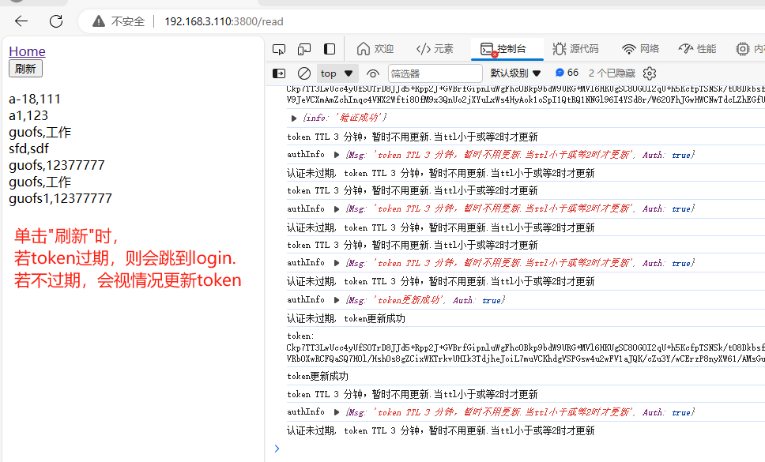

# about JWT and gToken
jwt在前后端分离项目中常用

jwt是token中一种实现方式之一，主要有如下两种第三方包。

JWT（JSON Web Token）是一种基于Token的身份验证和授权机制，它使用JSON格式来表示用户身份信息。
在前后端分离项目中常用该技术。

如[JWT-dgrijalva](https://pkg.go.dev/github.com/dgrijalva/jwt-go)和[JWT-form3tech](https://pkg.go.dev/github.com/form3tech-oss/jwt-go@v3.2.5+incompatible#section-documentation)

gToken是JWT一种，用来实现前后端基于Token的身份认证。

# gToken使用
gToken是一种非常简单实用的jwt第三方包，token采用AES/CBC模式加密。前后端都可以有效校验token包。
```text
UserID     int         `json:"userid"`     //用户id
UserName   string      `json:"username"`   //用户名称
UserEmail  string      `json:"email"`      //用户邮箱
UserMobile string      `json:"mobile"`     //用户电话
ExpiresAt time.Time    `json:"expire"`     //Token的TTL,即有效期。
IssuedAt time.Time     `json:"issuedat"`   //Token签发时间
Issuer string          `json:"issuer"`     //Token制作者
Subject string         `json:"subject"`    //Token应用的项目
TokenID string         `json:"tokenid"`    //TokenID,主要作用是校验前端提交的token是否真实，防止token泄露而带来的安全风险。
```

`func CreateToken(gtoken *Gtoken,key []byte) (string)`
创建token,其中key是16位或24位或32位的字符切片，返回BASE64字串。

`func CheckToken(encToken string, key []byte) (*Gtoken,int64,error)`
校验token,主要用来检查前端提供的token是否真实有效。
返回参数
- 第一个, token本身的数据信息
- 第二个, 本token的TTL值(分钟),0表示已失效。
- 第三个, err

模块安装
`go get github.com/guofusheng007/gtoken`
模块引用
```text
import (
	"github.com/guofusheng007/gtoken"
)
```

# 示例说明

前端react,用户登录(login)正确后，产生第一个token,存于cookie中。
程序提供一个刷新token的页面,每个页面会调用该update token的url。该程序读到cookie中的token,并前端自行校验,若token失效或不存在，会跳转到login页面生新生成初始化token. 若token有效，则在失效前的2分钟内(TTL小于或等于2)会向后端申请重签Token。

后端go服务收到前端提交的token重签请求后，会对前端提供的token及其它信息进行真实性核实，若真实有效，会签发新Token给前端，前端收到新Token后更新旧Token。

> 前端应用认证最长时间，取决于cookie和Token的两个TTL值，最小的TTL是前端最终有效的认证有效期，超过了就需通过login生新Token。

详细校验逻辑可查看example中的示例代码




